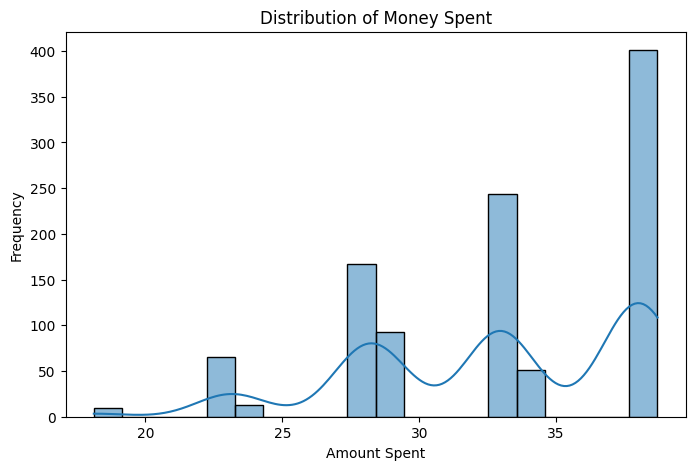
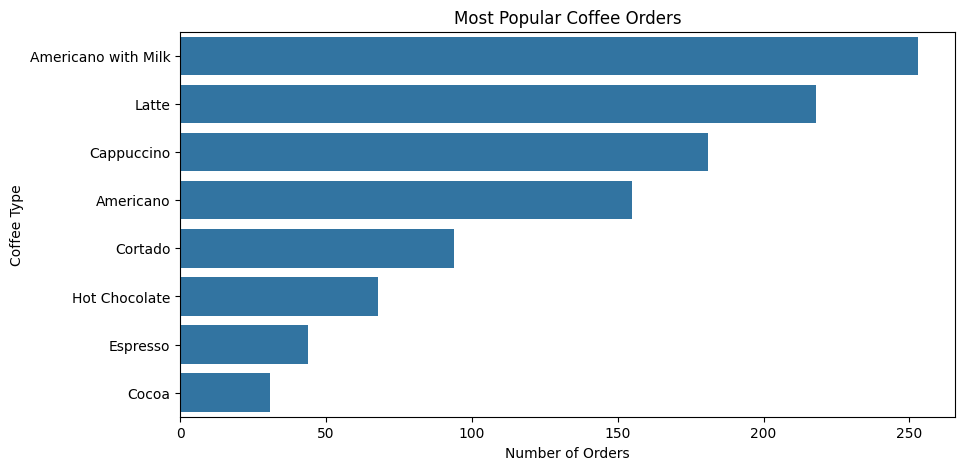
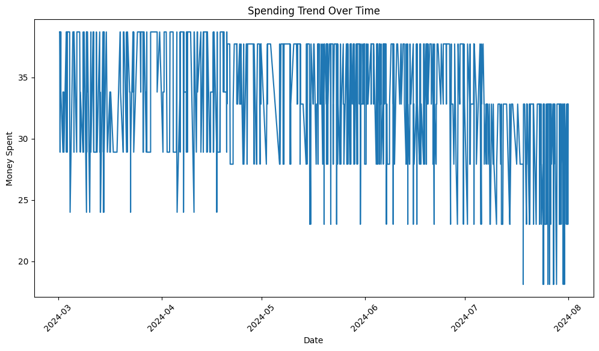
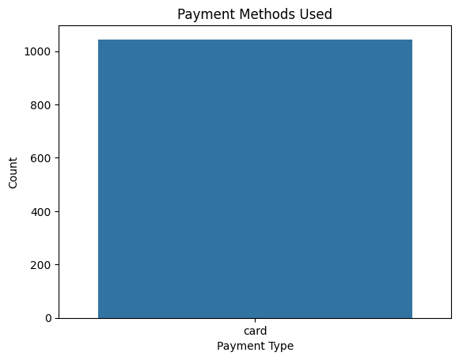
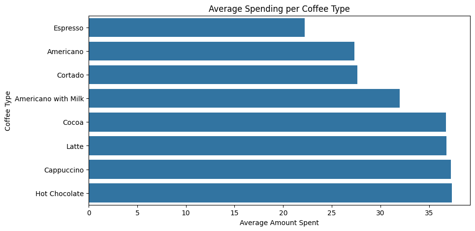
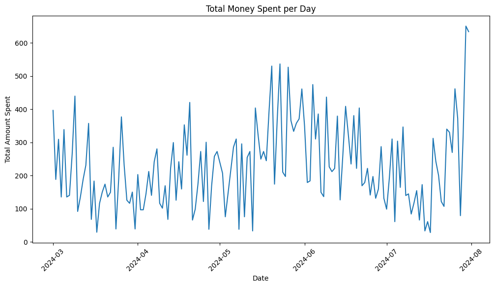

import pandas as pd
import numpy as np
import matplotlib.pyplot as plt
import seaborn as sns

print("Libraries imported successfully!")


```python
df = pd.read_csv("index(1).csv")  
df.head()   
```


    ---------------------------------------------------------------------------

    FileNotFoundError                         Traceback (most recent call last)

    Cell In[2], line 1
    ----> 1 df = pd.read_csv("index(1).csv")  
          2 df.head()
    

    File ~\AppData\Roaming\Python\Python312\site-packages\pandas\io\parsers\readers.py:1026, in read_csv(filepath_or_buffer, sep, delimiter, header, names, index_col, usecols, dtype, engine, converters, true_values, false_values, skipinitialspace, skiprows, skipfooter, nrows, na_values, keep_default_na, na_filter, verbose, skip_blank_lines, parse_dates, infer_datetime_format, keep_date_col, date_parser, date_format, dayfirst, cache_dates, iterator, chunksize, compression, thousands, decimal, lineterminator, quotechar, quoting, doublequote, escapechar, comment, encoding, encoding_errors, dialect, on_bad_lines, delim_whitespace, low_memory, memory_map, float_precision, storage_options, dtype_backend)
       1013 kwds_defaults = _refine_defaults_read(
       1014     dialect,
       1015     delimiter,
       (...)
       1022     dtype_backend=dtype_backend,
       1023 )
       1024 kwds.update(kwds_defaults)
    -> 1026 return _read(filepath_or_buffer, kwds)
    

    File ~\AppData\Roaming\Python\Python312\site-packages\pandas\io\parsers\readers.py:620, in _read(filepath_or_buffer, kwds)
        617 _validate_names(kwds.get("names", None))
        619 # Create the parser.
    --> 620 parser = TextFileReader(filepath_or_buffer, **kwds)
        622 if chunksize or iterator:
        623     return parser
    

    File ~\AppData\Roaming\Python\Python312\site-packages\pandas\io\parsers\readers.py:1620, in TextFileReader.__init__(self, f, engine, **kwds)
       1617     self.options["has_index_names"] = kwds["has_index_names"]
       1619 self.handles: IOHandles | None = None
    -> 1620 self._engine = self._make_engine(f, self.engine)
    

    File ~\AppData\Roaming\Python\Python312\site-packages\pandas\io\parsers\readers.py:1880, in TextFileReader._make_engine(self, f, engine)
       1878     if "b" not in mode:
       1879         mode += "b"
    -> 1880 self.handles = get_handle(
       1881     f,
       1882     mode,
       1883     encoding=self.options.get("encoding", None),
       1884     compression=self.options.get("compression", None),
       1885     memory_map=self.options.get("memory_map", False),
       1886     is_text=is_text,
       1887     errors=self.options.get("encoding_errors", "strict"),
       1888     storage_options=self.options.get("storage_options", None),
       1889 )
       1890 assert self.handles is not None
       1891 f = self.handles.handle
    

    File ~\AppData\Roaming\Python\Python312\site-packages\pandas\io\common.py:873, in get_handle(path_or_buf, mode, encoding, compression, memory_map, is_text, errors, storage_options)
        868 elif isinstance(handle, str):
        869     # Check whether the filename is to be opened in binary mode.
        870     # Binary mode does not support 'encoding' and 'newline'.
        871     if ioargs.encoding and "b" not in ioargs.mode:
        872         # Encoding
    --> 873         handle = open(
        874             handle,
        875             ioargs.mode,
        876             encoding=ioargs.encoding,
        877             errors=errors,
        878             newline="",
        879         )
        880     else:
        881         # Binary mode
        882         handle = open(handle, ioargs.mode)
    

    FileNotFoundError: [Errno 2] No such file or directory: 'index(1).csv'


```python
import os
print(os.listdir())

```

    ['.anaconda', '.cache', '.conda', '.condarc', '.continuum', '.docker', '.eclipse', '.emulator_console_auth_token', '.git', '.gitconfig', '.gradle', '.IdeaIC2017.3', '.IntelliJIdea2017.2', '.IntelliJIdea2017.3', '.ipynb_checkpoints', '.ipython', '.jupyter', '.lemminx', '.lesshst', '.m2', '.matplotlib', '.ms-ad', '.p2', '.sts4', '.viminfo', '.vscode', '3D Objects', 'anaconda3', 'AndroidStudioProjects', 'AppData', 'Application Data', 'ausbiz-consulting-app', 'Contacts', 'Cookies', 'CourseCRUD', 'courses-frontend', 'Desktop', 'Documents', 'Downloads', 'eclipse', 'eclipse-workspace', 'edb_pgjdbc.exe', 'Favorites', 'IdeaProjects', 'image-slider-3d', 'IntelGraphicsProfiles', 'job-portal-backend', 'job-portal-frontend', 'Links', 'Local Settings', 'Music', 'My Documents', 'my-next-app', 'NetHood', 'NTUSER.DAT', 'ntuser.dat.LOG1', 'ntuser.dat.LOG2', 'NTUSER.DAT{53b39e88-18c4-11ea-a811-000d3aa4692b}.TM.blf', 'NTUSER.DAT{53b39e88-18c4-11ea-a811-000d3aa4692b}.TMContainer00000000000000000001.regtrans-ms', 'NTUSER.DAT{53b39e88-18c4-11ea-a811-000d3aa4692b}.TMContainer00000000000000000002.regtrans-ms', 'ntuser.ini', 'OneDrive', 'Pictures', 'postgresql_15.exe', 'postgresql_15.exe-20240823042141', 'Postman', 'PrintHood', 'Recent', 'Saved Games', 'scraped_data.csv', 'ScStore', 'Searches', 'SendTo', 'signedapk.jks', 'Start Menu', 'StudioProjects', 'Templates', 'Tracing', 'Untitled.ipynb', 'Untitled1.ipynb', 'Untitled2.ipynb', 'Videos']
    


```python
df = pd.read_csv(r"C:\Users\dell\Downloads\index(1).csv")
df.head()
```


    ---------------------------------------------------------------------------

    FileNotFoundError                         Traceback (most recent call last)

    Cell In[4], line 1
    ----> 1 df = pd.read_csv(r"C:\Users\dell\Downloads\index(1).csv")
          2 df.head()
    

    File ~\AppData\Roaming\Python\Python312\site-packages\pandas\io\parsers\readers.py:1026, in read_csv(filepath_or_buffer, sep, delimiter, header, names, index_col, usecols, dtype, engine, converters, true_values, false_values, skipinitialspace, skiprows, skipfooter, nrows, na_values, keep_default_na, na_filter, verbose, skip_blank_lines, parse_dates, infer_datetime_format, keep_date_col, date_parser, date_format, dayfirst, cache_dates, iterator, chunksize, compression, thousands, decimal, lineterminator, quotechar, quoting, doublequote, escapechar, comment, encoding, encoding_errors, dialect, on_bad_lines, delim_whitespace, low_memory, memory_map, float_precision, storage_options, dtype_backend)
       1013 kwds_defaults = _refine_defaults_read(
       1014     dialect,
       1015     delimiter,
       (...)
       1022     dtype_backend=dtype_backend,
       1023 )
       1024 kwds.update(kwds_defaults)
    -> 1026 return _read(filepath_or_buffer, kwds)
    

    File ~\AppData\Roaming\Python\Python312\site-packages\pandas\io\parsers\readers.py:620, in _read(filepath_or_buffer, kwds)
        617 _validate_names(kwds.get("names", None))
        619 # Create the parser.
    --> 620 parser = TextFileReader(filepath_or_buffer, **kwds)
        622 if chunksize or iterator:
        623     return parser
    

    File ~\AppData\Roaming\Python\Python312\site-packages\pandas\io\parsers\readers.py:1620, in TextFileReader.__init__(self, f, engine, **kwds)
       1617     self.options["has_index_names"] = kwds["has_index_names"]
       1619 self.handles: IOHandles | None = None
    -> 1620 self._engine = self._make_engine(f, self.engine)
    

    File ~\AppData\Roaming\Python\Python312\site-packages\pandas\io\parsers\readers.py:1880, in TextFileReader._make_engine(self, f, engine)
       1878     if "b" not in mode:
       1879         mode += "b"
    -> 1880 self.handles = get_handle(
       1881     f,
       1882     mode,
       1883     encoding=self.options.get("encoding", None),
       1884     compression=self.options.get("compression", None),
       1885     memory_map=self.options.get("memory_map", False),
       1886     is_text=is_text,
       1887     errors=self.options.get("encoding_errors", "strict"),
       1888     storage_options=self.options.get("storage_options", None),
       1889 )
       1890 assert self.handles is not None
       1891 f = self.handles.handle
    

    File ~\AppData\Roaming\Python\Python312\site-packages\pandas\io\common.py:873, in get_handle(path_or_buf, mode, encoding, compression, memory_map, is_text, errors, storage_options)
        868 elif isinstance(handle, str):
        869     # Check whether the filename is to be opened in binary mode.
        870     # Binary mode does not support 'encoding' and 'newline'.
        871     if ioargs.encoding and "b" not in ioargs.mode:
        872         # Encoding
    --> 873         handle = open(
        874             handle,
        875             ioargs.mode,
        876             encoding=ioargs.encoding,
        877             errors=errors,
        878             newline="",
        879         )
        880     else:
        881         # Binary mode
        882         handle = open(handle, ioargs.mode)
    

    FileNotFoundError: [Errno 2] No such file or directory: 'C:\\Users\\dell\\Downloads\\index(1).csv'


```python
df = pd.read_csv("index(1).csv")
df.head()

```


    ---------------------------------------------------------------------------

    FileNotFoundError                         Traceback (most recent call last)

    Cell In[5], line 1
    ----> 1 df = pd.read_csv("index(1).csv")
          2 df.head()
    

    File ~\AppData\Roaming\Python\Python312\site-packages\pandas\io\parsers\readers.py:1026, in read_csv(filepath_or_buffer, sep, delimiter, header, names, index_col, usecols, dtype, engine, converters, true_values, false_values, skipinitialspace, skiprows, skipfooter, nrows, na_values, keep_default_na, na_filter, verbose, skip_blank_lines, parse_dates, infer_datetime_format, keep_date_col, date_parser, date_format, dayfirst, cache_dates, iterator, chunksize, compression, thousands, decimal, lineterminator, quotechar, quoting, doublequote, escapechar, comment, encoding, encoding_errors, dialect, on_bad_lines, delim_whitespace, low_memory, memory_map, float_precision, storage_options, dtype_backend)
       1013 kwds_defaults = _refine_defaults_read(
       1014     dialect,
       1015     delimiter,
       (...)
       1022     dtype_backend=dtype_backend,
       1023 )
       1024 kwds.update(kwds_defaults)
    -> 1026 return _read(filepath_or_buffer, kwds)
    

    File ~\AppData\Roaming\Python\Python312\site-packages\pandas\io\parsers\readers.py:620, in _read(filepath_or_buffer, kwds)
        617 _validate_names(kwds.get("names", None))
        619 # Create the parser.
    --> 620 parser = TextFileReader(filepath_or_buffer, **kwds)
        622 if chunksize or iterator:
        623     return parser
    

    File ~\AppData\Roaming\Python\Python312\site-packages\pandas\io\parsers\readers.py:1620, in TextFileReader.__init__(self, f, engine, **kwds)
       1617     self.options["has_index_names"] = kwds["has_index_names"]
       1619 self.handles: IOHandles | None = None
    -> 1620 self._engine = self._make_engine(f, self.engine)
    

    File ~\AppData\Roaming\Python\Python312\site-packages\pandas\io\parsers\readers.py:1880, in TextFileReader._make_engine(self, f, engine)
       1878     if "b" not in mode:
       1879         mode += "b"
    -> 1880 self.handles = get_handle(
       1881     f,
       1882     mode,
       1883     encoding=self.options.get("encoding", None),
       1884     compression=self.options.get("compression", None),
       1885     memory_map=self.options.get("memory_map", False),
       1886     is_text=is_text,
       1887     errors=self.options.get("encoding_errors", "strict"),
       1888     storage_options=self.options.get("storage_options", None),
       1889 )
       1890 assert self.handles is not None
       1891 f = self.handles.handle
    

    File ~\AppData\Roaming\Python\Python312\site-packages\pandas\io\common.py:873, in get_handle(path_or_buf, mode, encoding, compression, memory_map, is_text, errors, storage_options)
        868 elif isinstance(handle, str):
        869     # Check whether the filename is to be opened in binary mode.
        870     # Binary mode does not support 'encoding' and 'newline'.
        871     if ioargs.encoding and "b" not in ioargs.mode:
        872         # Encoding
    --> 873         handle = open(
        874             handle,
        875             ioargs.mode,
        876             encoding=ioargs.encoding,
        877             errors=errors,
        878             newline="",
        879         )
        880     else:
        881         # Binary mode
        882         handle = open(handle, ioargs.mode)
    

    FileNotFoundError: [Errno 2] No such file or directory: 'index(1).csv'


```python
import os
print(os.listdir())
```

    ['.anaconda', '.cache', '.conda', '.condarc', '.continuum', '.docker', '.eclipse', '.emulator_console_auth_token', '.git', '.gitconfig', '.gradle', '.IdeaIC2017.3', '.IntelliJIdea2017.2', '.IntelliJIdea2017.3', '.ipynb_checkpoints', '.ipython', '.jupyter', '.lemminx', '.lesshst', '.m2', '.matplotlib', '.ms-ad', '.p2', '.sts4', '.viminfo', '.vscode', '3D Objects', 'anaconda3', 'AndroidStudioProjects', 'AppData', 'Application Data', 'ausbiz-consulting-app', 'Contacts', 'Cookies', 'CourseCRUD', 'courses-frontend', 'Desktop', 'Documents', 'Downloads', 'eclipse', 'eclipse-workspace', 'edb_pgjdbc.exe', 'Favorites', 'IdeaProjects', 'image-slider-3d', 'index (1).csv', 'IntelGraphicsProfiles', 'job-portal-backend', 'job-portal-frontend', 'Links', 'Local Settings', 'Music', 'My Documents', 'my-next-app', 'NetHood', 'NTUSER.DAT', 'ntuser.dat.LOG1', 'ntuser.dat.LOG2', 'NTUSER.DAT{53b39e88-18c4-11ea-a811-000d3aa4692b}.TM.blf', 'NTUSER.DAT{53b39e88-18c4-11ea-a811-000d3aa4692b}.TMContainer00000000000000000001.regtrans-ms', 'NTUSER.DAT{53b39e88-18c4-11ea-a811-000d3aa4692b}.TMContainer00000000000000000002.regtrans-ms', 'ntuser.ini', 'OneDrive', 'Pictures', 'postgresql_15.exe', 'postgresql_15.exe-20240823042141', 'Postman', 'PrintHood', 'Recent', 'Saved Games', 'scraped_data.csv', 'ScStore', 'Searches', 'SendTo', 'signedapk.jks', 'Start Menu', 'StudioProjects', 'Templates', 'Tracing', 'Untitled.ipynb', 'Untitled1.ipynb', 'Untitled2.ipynb', 'Videos']
    


```python
df = pd.read_csv("index (1).csv")
df.head()

```


<div>
<style scoped>
    .dataframe tbody tr th:only-of-type {
        vertical-align: middle;
    }

    .dataframe tbody tr th {
        vertical-align: top;
    }

    .dataframe thead th {
        text-align: right;
    }
</style>
<table border="1" class="dataframe">
  <thead>
    <tr style="text-align: right;">
      <th></th>
      <th>date</th>
      <th>datetime</th>
      <th>cash_type</th>
      <th>card</th>
      <th>money</th>
      <th>coffee_name</th>
    </tr>
  </thead>
  <tbody>
    <tr>
      <th>0</th>
      <td>2024-03-01</td>
      <td>2024-03-01 10:15:50.520</td>
      <td>card</td>
      <td>ANON-0000-0000-0001</td>
      <td>38.7</td>
      <td>Latte</td>
    </tr>
    <tr>
      <th>1</th>
      <td>2024-03-01</td>
      <td>2024-03-01 12:19:22.539</td>
      <td>card</td>
      <td>ANON-0000-0000-0002</td>
      <td>38.7</td>
      <td>Hot Chocolate</td>
    </tr>
    <tr>
      <th>2</th>
      <td>2024-03-01</td>
      <td>2024-03-01 12:20:18.089</td>
      <td>card</td>
      <td>ANON-0000-0000-0002</td>
      <td>38.7</td>
      <td>Hot Chocolate</td>
    </tr>
    <tr>
      <th>3</th>
      <td>2024-03-01</td>
      <td>2024-03-01 13:46:33.006</td>
      <td>card</td>
      <td>ANON-0000-0000-0003</td>
      <td>28.9</td>
      <td>Americano</td>
    </tr>
    <tr>
      <th>4</th>
      <td>2024-03-01</td>
      <td>2024-03-01 13:48:14.626</td>
      <td>card</td>
      <td>ANON-0000-0000-0004</td>
      <td>38.7</td>
      <td>Latte</td>
    </tr>
  </tbody>
</table>
</div>


```python
df.info()  # Shows column names and data types
df.describe()  # Summary statistics
df.isnull().sum()  # Check missing values

```

    <class 'pandas.core.frame.DataFrame'>
    RangeIndex: 1133 entries, 0 to 1132
    Data columns (total 6 columns):
     #   Column       Non-Null Count  Dtype  
    ---  ------       --------------  -----  
     0   date         1133 non-null   object 
     1   datetime     1133 non-null   object 
     2   cash_type    1133 non-null   object 
     3   card         1044 non-null   object 
     4   money        1133 non-null   float64
     5   coffee_name  1133 non-null   object 
    dtypes: float64(1), object(5)
    memory usage: 53.2+ KB
    


    date            0
    datetime        0
    cash_type       0
    card           89
    money           0
    coffee_name     0
    dtype: int64


```python
df.dropna(inplace=True)  # Removes missing values

```


```python
sns.histplot(df["rating"], bins=20, kde=True)
plt.show()

```


    ---------------------------------------------------------------------------

    KeyError                                  Traceback (most recent call last)

    File ~\AppData\Roaming\Python\Python312\site-packages\pandas\core\indexes\base.py:3805, in Index.get_loc(self, key)
       3804 try:
    -> 3805     return self._engine.get_loc(casted_key)
       3806 except KeyError as err:
    

    File index.pyx:167, in pandas._libs.index.IndexEngine.get_loc()
    

    File index.pyx:196, in pandas._libs.index.IndexEngine.get_loc()
    

    File pandas\\_libs\\hashtable_class_helper.pxi:7081, in pandas._libs.hashtable.PyObjectHashTable.get_item()
    

    File pandas\\_libs\\hashtable_class_helper.pxi:7089, in pandas._libs.hashtable.PyObjectHashTable.get_item()
    

    KeyError: 'rating'

    
    The above exception was the direct cause of the following exception:
    

    KeyError                                  Traceback (most recent call last)

    Cell In[10], line 1
    ----> 1 sns.histplot(df["rating"], bins=20, kde=True)
          2 plt.show()
    

    File ~\AppData\Roaming\Python\Python312\site-packages\pandas\core\frame.py:4102, in DataFrame.__getitem__(self, key)
       4100 if self.columns.nlevels > 1:
       4101     return self._getitem_multilevel(key)
    -> 4102 indexer = self.columns.get_loc(key)
       4103 if is_integer(indexer):
       4104     indexer = [indexer]
    

    File ~\AppData\Roaming\Python\Python312\site-packages\pandas\core\indexes\base.py:3812, in Index.get_loc(self, key)
       3807     if isinstance(casted_key, slice) or (
       3808         isinstance(casted_key, abc.Iterable)
       3809         and any(isinstance(x, slice) for x in casted_key)
       3810     ):
       3811         raise InvalidIndexError(key)
    -> 3812     raise KeyError(key) from err
       3813 except TypeError:
       3814     # If we have a listlike key, _check_indexing_error will raise
       3815     #  InvalidIndexError. Otherwise we fall through and re-raise
       3816     #  the TypeError.
       3817     self._check_indexing_error(key)
    

    KeyError: 'rating'


```python
print(df.columns)

```

    Index(['date', 'datetime', 'cash_type', 'card', 'money', 'coffee_name'], dtype='object')
    


```python
# Check for missing values
print(df.isnull().sum())

# Get summary statistics (only for numerical columns)
print(df.describe())

# Get unique values in categorical columns
print(df['cash_type'].unique())  # Example for categorical column
print(df['coffee_name'].unique())  # Example for coffee names

# Check data types
print(df.dtypes)

```

    date           0
    datetime       0
    cash_type      0
    card           0
    money          0
    coffee_name    0
    dtype: int64
                 money
    count  1044.000000
    mean     32.876322
    std       4.981218
    min      18.120000
    25%      28.900000
    50%      32.820000
    75%      37.720000
    max      38.700000
    ['card']
    ['Latte' 'Hot Chocolate' 'Americano' 'Americano with Milk' 'Cocoa'
     'Cortado' 'Espresso' 'Cappuccino']
    date            object
    datetime        object
    cash_type       object
    card            object
    money          float64
    coffee_name     object
    dtype: object
    


```python
df['datetime'] = pd.to_datetime(df['datetime'])

```


```python
df.fillna(method='ffill', inplace=True)  # Forward fill missing values

```

    C:\Users\dell\AppData\Local\Temp\ipykernel_11356\1421584536.py:1: FutureWarning: DataFrame.fillna with 'method' is deprecated and will raise in a future version. Use obj.ffill() or obj.bfill() instead.
      df.fillna(method='ffill', inplace=True)  # Forward fill missing values
    


```python
import seaborn as sns
import matplotlib.pyplot as plt

plt.figure(figsize=(8, 5))
sns.histplot(df['money'], bins=20, kde=True)
plt.title('Distribution of Money Spent')
plt.xlabel('Amount Spent')
plt.ylabel('Frequency')
plt.show()

```


    

    


```python
plt.figure(figsize=(10, 5))
sns.countplot(y='coffee_name', data=df, order=df['coffee_name'].value_counts().index)
plt.title('Most Popular Coffee Orders')
plt.xlabel('Number of Orders')
plt.ylabel('Coffee Type')
plt.show()

```


    

    


```python
plt.figure(figsize=(12, 6))
sns.lineplot(x=df['datetime'], y=df['money'])
plt.title('Spending Trend Over Time')
plt.xlabel('Date')
plt.ylabel('Money Spent')
plt.xticks(rotation=45)
plt.show()

```


    

    


```python
sns.countplot(x='cash_type', data=df)
plt.title('Payment Methods Used')
plt.xlabel('Payment Type')
plt.ylabel('Count')
plt.show()

```


    

    


```python
avg_spent_per_coffee = df.groupby('coffee_name')['money'].mean().sort_values()
plt.figure(figsize=(10, 5))
sns.barplot(x=avg_spent_per_coffee.values, y=avg_spent_per_coffee.index)
plt.title('Average Spending per Coffee Type')
plt.xlabel('Average Amount Spent')
plt.ylabel('Coffee Type')
plt.show()

```


    

    


```python
daily_spending = df.groupby(df['datetime'].dt.date)['money'].sum()
plt.figure(figsize=(12, 6))
sns.lineplot(x=daily_spending.index, y=daily_spending.values)
plt.title('Total Money Spent per Day')
plt.xlabel('Date')
plt.ylabel('Total Amount Spent')
plt.xticks(rotation=45)
plt.show()

```


    

    


```python
df.to_csv("cleaned_coffee_data.csv", index=False)

```


```python

```
